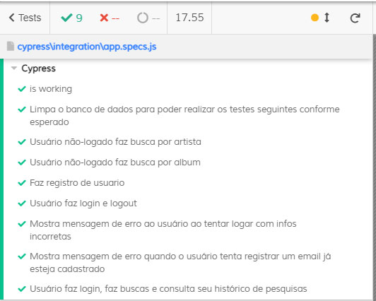

# Last.fm Search App

Aplicação em React que permite buscas por artista ou por álbum, utilizando a API do Last.fm.

O backend em NodeJS, Express e MongoDB permite o cadastro de usuários.

Uma vez cadastrado e logado, as pesquisas do usuário são salvas em um item (específico para aquele usuário) no localStorage,
de forma que ao acessar a página de consulta do histórico de pesquisas, o usuário tem acesso às 10 últimas pesquisas que ele(a) realizou.

## Screenshots


## Instruções para instalação e setup

### Requisitos

- Ter o NodeJS instalado (de preferência a última versão ou superior à v14.15.4)
> [Instalando o Node](https://nodejs.org/pt-br/download/package-manager/ "Clique aqui para aprender a instalar o Node!")

- Ter o gerenciador de dependências yarn instalado (npm também funciona, porém recomendo o yarn)
> [Instalando o yarn](https://classic.yarnpkg.com/pt-BR/docs/install/#debian-stable "Clique aqui para aprender a instalar o yarn!")

### Setup

Clone este repositório.
Com o Git instalado, digite no terminal:
```shell
cd <diretório da sua preferência>
git clone https://github.com/rodgabriel/lastfm-app.git
```

### Inicialização 

Acesse a pasta do projeto que você clonou e instale as depedências.

No backend:
```shell
cd lastfm-app
yarn
```
No frontend:
```shell
>lastfm-app/ cd client
yarn
```

Volte para a root do projeto e rode o projeto:
```shell
>lastfm-app/client cd ../
yarn dev
```

## Testando a aplicação

Suíte de testes utilizando [Cypress](https://www.cypress.io/).

Com o projeto rodando (tanto frontend, quanto backend), acesse o frontend da aplicação e execute o cypress:
```shell
>lastfm-app cd client
yarn cypress
```


