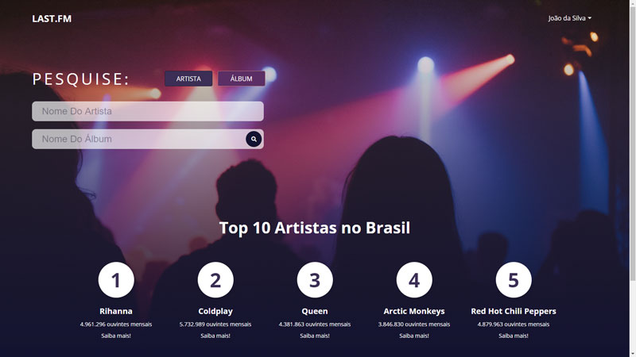
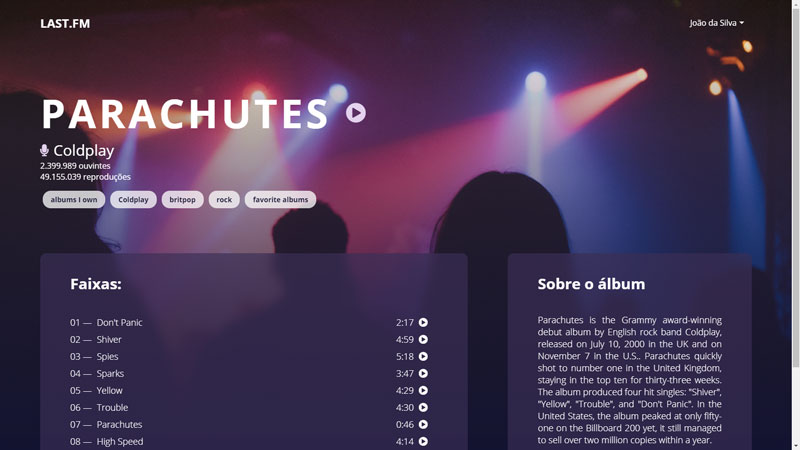

# Last.fm Search App

Aplicação em React que permite buscas por artista ou por álbum, utilizando a API do Last.fm.

O backend em NodeJS, Express e MongoDB permite o cadastro de usuários.

## Screenshots

## Instruções para instalação e setup

### Requisitos

- Ter o NodeJS instalado (de preferência a última versão ou superior à v14.15.4)

